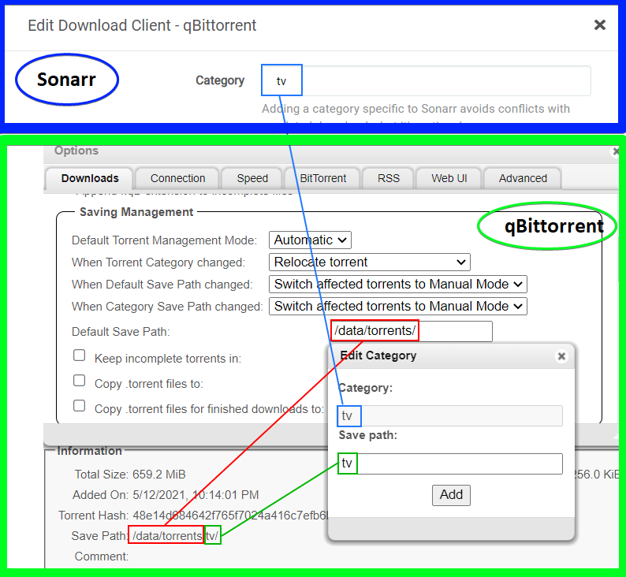

# qBittorent

- [qBittorent](#qbittorent)
  - [App Settings](#app-settings)
    - [Downloads](#downloads)
      - [When adding a torrent](#when-adding-a-torrent)
      - [Saving Management](#saving-management)
    - [Connection](#connection)
    - [Speed](#speed)
    - [Bittorrent](#bittorrent)
      - [Privacy](#privacy)
      - [Torrent Queueing](#torrent-queueing)
      - [Seeding Limits](#seeding-limits)
      - [Automatically add these trackers to new downloads](#automatically-add-these-trackers-to-new-downloads)
    - [Web UI](#web-ui)
  - [Tags management](#tags-management)
  - [Test connection through Gluetun](#test-connection-through-gluetun)

## App Settings

Followed this [Trash-Guides guide](https://trash-guides.info/Downloaders/qBittorrent/Basic-Setup/).

### Downloads

`Tools => Options => Downloads `

#### When adding a torrent

> TLDR; original content layout, deleting `.torrent` files after download, and enabling pre-allocation of disk space

1. Torrent content layout = `original`

2. Deleting `.torrent` file  = ... personal preference... **I'm choosing to delete on the Pi** to conserve space, otherwise I'd keep till I have a better understanding of torrenting and the purpose of the `.torrent` file.
    
    After downloading is complete, the .torrent file serves limited purposes, which may be wanted:
   1. **Re-adding the torrent**: If you delete the torrent from your client but keep the .torrent file, you can re-add it later to start seeding or downloading the file again without re-downloading the metadata.
   2. **Sharing the torrent**: You can give the .torrent file to others so they can join the swarm and download the file.
   3. **Backup**: It can act as a backup to resume the torrent in the future if the client loses its configuration or metadata.

3. Pre-allocate disk space for all files = `Enabled`
    
    Pre-allocated disk space for the added torrents limits fragmentation and also makes sure if you use a cache drive or a feeder disk that the space is available.
    However, be cautious to set Pre-allocated disk space if you are using ZFS as filesystem as [ZFS does not support fallocate??](https://github.com/openzfs/zfs/issues/326)

4. Append .!qB extension to incomplete files = `Enabled`, for my own sanity.

#### Saving Management

> TLDR; automatic management mode for categories, relocation enabled for all changes, default save path is to `downloads/`, don't keep incomplete files in separate folder, don't keep copies of `.torrent` files 

> qBittorent is mounted into the `data/downloads/` directory on the host.

1. Default Torrent management mode = `automatic`

    Required for downloads to go into the category folder.

2. When Torrent category changed = `relocate torrent`

    This helps you to manage your file location based on categories.

3. When Default save path changed = When category save path changed = `relocate affected torrent`

4. Default save path = `downloads/`. 

5. Keep incomplete torrents = `Disabled`

    Incomplete downloads will be placed in this directory until completed. Enabling this results in extra unnecessary moves or in worse cases a slower and more I/O intensive copy + delete.

### Connection

`Tools => Options => Connections `

> TLDR; set Peer connection protocol to `TCP` and leave everything the same ESPECIALLY the listening port.

For more: [TRaSH Guides: Qbittorrent basic setup - Connection](https://trash-guides.info/Downloaders/qBittorrent/Basic-Setup/#connection)

### Speed

`Tools => Options => Speed `

> TLDR; global rate limit to 80% of typical upload/download speed, set alternate rate limits to unlimited in the dead hours of the night. Got typical upload/download from speedtest tracker. Set to 80% as suggested in guide.

Other than limits, everything is default.

For more: [TRaSH Guides: Qbittorrent basic setup - Speed](https://trash-guides.info/Downloaders/qBittorrent/Basic-Setup/#speed)

### Bittorrent

`Tools => Options => Bittorrent `

#### Privacy

> TLDR; peer stuff on, encryption allowed, disabled anonymous mode due to reported worse speeds.

#### Torrent Queueing

> TLDR; leaving on default enabled limits, as I don't want to hammer my internet connection.

#### Seeding Limits

> TLDR; leave disabled as suggested.

#### Automatically add these trackers to new downloads

> TLDR; disabled as using Prowlarr for index management

> Trash guides: ‼ NEVER USE THIS OPTION ON (Semi-)PRIVATE TRACKERS ‼

### Web UI

> TLDR; no auth bypass, left security protections on

## Tags management

1. `Default Torrent Management Mode` in `Saving Management` must be set to `Automatic`.
2. The category name on Sonarr/Radarr/Bazarr/etc... matches on category name in qbittorrent, so make sure that they are identical.
3. Category `save path` is relative to the default saving location (e.g. `downloads/`), so category TV with save path `tv` will be saved to `downloads/tv`.

## Test connection through Gluetun

With qBit up and running, and gluetun service healthy, torrent the link at [Whatismyi's Torrent Tracker IP Checker](https://www.whatismyip.net/tools/torrent-ip-checker/index.php?hash=3d0fd31d34790d192f61e94ef797ad904150d57c).

This tracker will show you the IP that is coming from qbittorent. If the IP showing is the server's IP OR not Gluetun's IP, there is a leak in the VPN connection.