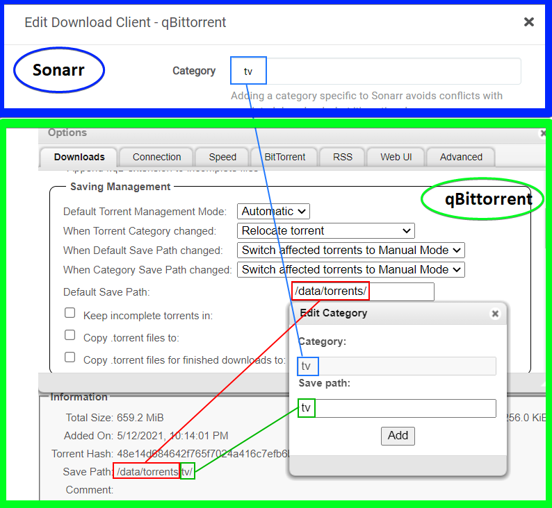

# Starr tags management

1. `Default Torrent Management Mode` in `Saving Management` must be set to `Automatic`.
2. The category name on Sonarr/Radarr/Bazarr/etc... matches on category name in qbittorrent, so make sure that they are identical.
3. Category `save path` is relative to the default saving location (e.g. `downloads/`), so category TV with save path `tv` will be saved to `downloads/tv`.

